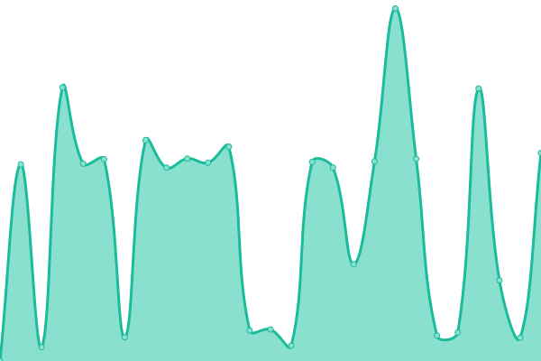
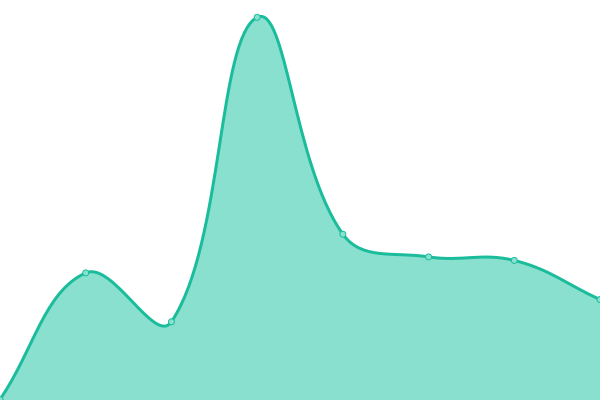

# [📈 Live Status](https://demo.upptime.js.org): <!--live status--> **🟧 Partial outage**

This repository contains the open-source uptime monitor and status page for [Upptime](https://upptime.js.org), powered by [Upptime](https://github.com/upptime/upptime).

With [Upptime](https://upptime.js.org), you can get your own unlimited and free uptime monitor and status page, powered entirely by a GitHub repository. We use [Issues](https://github.com/upptime/upptime/issues) as incident reports, [Actions](https://github.com/ialopezc/upptime/actions) as uptime monitors, and [Pages](https://demo.upptime.js.org) for the status page.

<!--start: status pages-->
<!-- This summary is generated by Upptime (https://github.com/upptime/upptime) -->
<!-- Do not edit this manually, your changes will be overwritten -->
<!-- prettier-ignore -->
| URL | Status | History | Response Time | Uptime |
| --- | ------ | ------- | ------------- | ------ |
|  [MONITOR](https://demo.imovit.net/) | 🟩 Up | [monitor.yml](https://github.com/ialopezc/upptimeSuntech/commits/HEAD/history/monitor.yml) | 

 316ms
     
 | 

<a href="https://ialopezc.github.io/history/monitor">100.00%</a>
    

|  [WEBAPP](https://demo.imovit.net/webApp/) | 🟩 Up | [webapp.yml](https://github.com/ialopezc/upptimeSuntech/commits/HEAD/history/webapp.yml) | 

 27ms
     
 | 

<a href="https://ialopezc.github.io/history/webapp">100.00%</a>
    

|  [SIAD](https://siad.imovit.net/) | 🟩 Up | [siad.yml](https://github.com/ialopezc/upptimeSuntech/commits/HEAD/history/siad.yml) | 

 324ms
     
 | 

<a href="https://ialopezc.github.io/history/siad">100.00%</a>
    

|  [CONTROL](https://democontrol.imovit.net/) | 🟩 Up | [control.yml](https://github.com/ialopezc/upptimeSuntech/commits/HEAD/history/control.yml) | 

 474ms
     
 | 

<a href="https://ialopezc.github.io/history/control">100.00%</a>
    

|  [MONITOR staging](https://awsdev.imovit.net/) | 🟩 Up | [monitor-staging.yml](https://github.com/ialopezc/upptimeSuntech/commits/HEAD/history/monitor-staging.yml) | 

 291ms
     
 | 

<a href="https://ialopezc.github.io/history/monitor-staging">100.00%</a>
    

|  [WEBAPP staging](https://awsdev.imovit.net/webApp/) | 🟩 Up | [webapp-staging.yml](https://github.com/ialopezc/upptimeSuntech/commits/HEAD/history/webapp-staging.yml) | 

 31ms
     
 | 

<a href="https://ialopezc.github.io/history/webapp-staging">100.00%</a>
    

|  [SIAD staging](https://siaddev.imovit.net/) | 🟩 Up | [siad-staging.yml](https://github.com/ialopezc/upptimeSuntech/commits/HEAD/history/siad-staging.yml) | 

 287ms
     
 | 

<a href="https://ialopezc.github.io/history/siad-staging">100.00%</a>
    

|  [CONTROL staging](https://awsdevcontrol.imovit.net/) | 🟩 Up | [control-staging.yml](https://github.com/ialopezc/upptimeSuntech/commits/HEAD/history/control-staging.yml) | 

 455ms
     
 | 

<a href="https://ialopezc.github.io/history/control-staging">100.00%</a>
    

|  [SCUTI Prod](https://www.suntechscuti.com/scuti/) | 🟩 Up | [scuti-prod.yml](https://github.com/ialopezc/upptimeSuntech/commits/HEAD/history/scuti-prod.yml) | 

 1225ms
     
 | 

<a href="https://ialopezc.github.io/history/scuti-prod">100.00%</a>
    

|  [SCUTI Brasil](https://scuti.suntechdobrasil.com.br/) | 🟥 Down | [scuti-brasil.yml](https://github.com/ialopezc/upptimeSuntech/commits/HEAD/history/scuti-brasil.yml) | 

 3489ms
     
 | 

<a href="https://ialopezc.github.io/history/scuti-brasil">87.40%</a>
    

|  [SCUTI Dev](http://scutidevelop.suntechlatam.com/) | 🟩 Up | [scuti-dev.yml](https://github.com/ialopezc/upptimeSuntech/commits/HEAD/history/scuti-dev.yml) | 

 343ms
     
 | 

<a href="https://ialopezc.github.io/history/scuti-dev">100.00%</a>
    

|  [SCUTI Test](https://scutitest.suntechlatam.com/) | 🟩 Up | [scuti-test.yml](https://github.com/ialopezc/upptimeSuntech/commits/HEAD/history/scuti-test.yml) | 

 351ms
     
 | 

<a href="https://ialopezc.github.io/history/scuti-test">100.00%</a>
    

<!--end: status pages-->

[**Visit our status website →**](https://demo.upptime.js.org)

## 📄 License

- Powered by: [Upptime](https://github.com/upptime/upptime)
- Code: [MIT](./LICENSE) © [Anand Chowdhary](https://anandchowdhary.com), supported by [Pabio](https://pabio.com)
- Data in the `./history` directory: [Open Database License](https://opendatacommons.org/licenses/odbl/1-0/)
