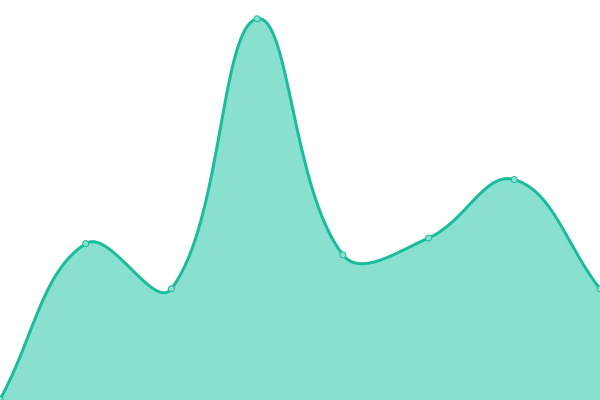

# [📈 Live Status](https://demo.upptime.js.org): <!--live status--> **🟩 All systems operational**

This repository contains the open-source uptime monitor and status page for [Upptime](https://upptime.js.org), powered by [Upptime](https://github.com/upptime/upptime).

With [Upptime](https://upptime.js.org), you can get your own unlimited and free uptime monitor and status page, powered entirely by a GitHub repository. We use [Issues](https://github.com/upptime/upptime/issues) as incident reports, [Actions](https://github.com/ialopezc/upptime/actions) as uptime monitors, and [Pages](https://demo.upptime.js.org) for the status page.

<!--start: status pages-->
<!-- This summary is generated by Upptime (https://github.com/upptime/upptime) -->
<!-- Do not edit this manually, your changes will be overwritten -->
<!-- prettier-ignore -->
| URL | Status | History | Response Time | Uptime |
| --- | ------ | ------- | ------------- | ------ |
|  [Monitor Staging](https://awsdev.imovit.net/) | 🟩 Up | [monitor-staging.yml](https://github.com/ialopezc/upptimeSuntech/commits/HEAD/history/monitor-staging.yml) | 

 292ms
     
 | 

<a href="https://ialopezc.github.io/history/monitor-staging">100.00%</a>
    

|  [Monitor](https://demo.imovit.net/) | 🟩 Up | [monitor.yml](https://github.com/ialopezc/upptimeSuntech/commits/HEAD/history/monitor.yml) | 

 268ms
     
 | 

<a href="https://ialopezc.github.io/history/monitor">100.00%</a>
    

|  [webApp staging](https://awsdev.imovit.net/webApp/) | 🟩 Up | [web-app-staging.yml](https://github.com/ialopezc/upptimeSuntech/commits/HEAD/history/web-app-staging.yml) | 

 37ms
     
 | 

<a href="https://ialopezc.github.io/history/web-app-staging">100.00%</a>
    

|  [webApp](https://demo.imovit.net/webApp/) | 🟩 Up | [web-app.yml](https://github.com/ialopezc/upptimeSuntech/commits/HEAD/history/web-app.yml) | 

 42ms
     
 | 

<a href="https://ialopezc.github.io/history/web-app">100.00%</a>
    

|  [SIAD Staging](https://siaddev.imovit.net/) | 🟩 Up | [siad-staging.yml](https://github.com/ialopezc/upptimeSuntech/commits/HEAD/history/siad-staging.yml) | 

 383ms
     
 | 

<a href="https://ialopezc.github.io/history/siad-staging">100.00%</a>
    

|  [SIAD](https://siad.imovit.net/) | 🟩 Up | [siad.yml](https://github.com/ialopezc/upptimeSuntech/commits/HEAD/history/siad.yml) | 

 278ms
     
 | 

<a href="https://ialopezc.github.io/history/siad">100.00%</a>
    

|  [CONTROL Staging](https://awsdevcontrol.imovit.net/) | 🟩 Up | [control-staging.yml](https://github.com/ialopezc/upptimeSuntech/commits/HEAD/history/control-staging.yml) | 

 560ms
     
 | 

<a href="https://ialopezc.github.io/history/control-staging">100.00%</a>
    

|  [CONTROL](https://democontrol.imovit.net/) | 🟩 Up | [control.yml](https://github.com/ialopezc/upptimeSuntech/commits/HEAD/history/control.yml) | 

 540ms
     
 | 

<a href="https://ialopezc.github.io/history/control">100.00%</a>
    

<!--end: status pages-->

[**Visit our status website →**](https://demo.upptime.js.org)

## 📄 License

- Powered by: [Upptime](https://github.com/upptime/upptime)
- Code: [MIT](./LICENSE) © [Anand Chowdhary](https://anandchowdhary.com), supported by [Pabio](https://pabio.com)
- Data in the `./history` directory: [Open Database License](https://opendatacommons.org/licenses/odbl/1-0/)
